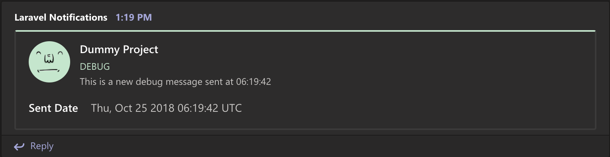
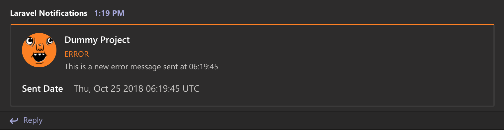
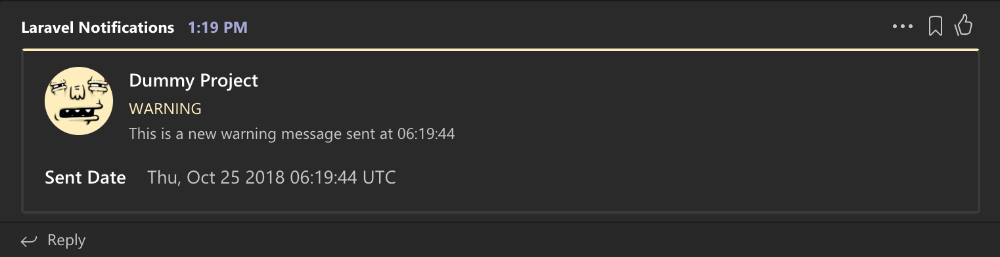
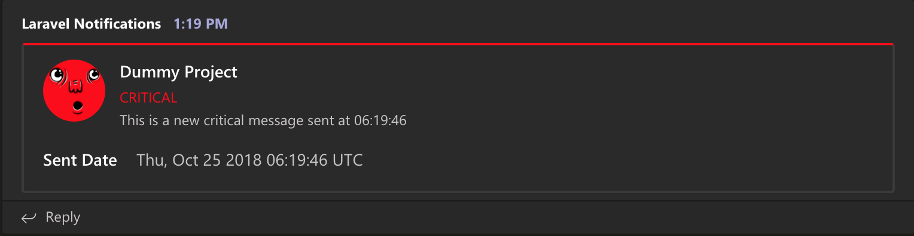

# Laravel Teams Logging

[![Software License][ico-license]](LICENSE)
[![Latest Version on Packagist][ico-version]][link-packagist]
[![Total Downloads][ico-downloads]][link-downloads]

A Laravel logging channel that sends application log messages directly to **Microsoft Teams** using an Incoming Webhook.

## Features

- Supports Laravel and Lumen
- Supports all Laravel log levels
- Compatible with Laravel's `stack` logging channel
- Two message styles:
    - **Simple** – lightweight notifications
    - **Card** – rich formatted messages with context
- Application/project name (Optional)

## Installation

Install the package via Composer:

```bash
composer require zanysoft/laravel-teams-logging
```

### Laravel

Register the service provider in `config/app.php` if required:

```php
ZanySoft\LaravelTeamsLogging\LoggerServiceProvider::class,
```

Publish the configuration file:

```bash
php artisan vendor:publish --provider="ZanySoft\LaravelTeamsLogging\LoggerServiceProvider"
```

### Lumen

Register the service provider in `bootstrap/app.php`:

```php
$app->register(
    ZanySoft\LaravelTeamsLogging\LoggerServiceProvider::class
);
```

Copy the package configuration file to your application's `config` directory, then enable it in `bootstrap/app.php`:

```php
$app->configure('teams');
```

## Configuration

Create a custom logging channel in `config/logging.php`:

```php
'teams' => [
    'driver' => 'custom',
    'via'    => ZanySoft\LaravelTeamsLogging\LoggerChannel::class,
    'level'  => 'debug',
    'url'    => env('TEAMS_WEBHOOK_URL')
],
```

### Environment

Add folloing details to your `.env` file:
- Message title (default value is APP_NAME)
- Message style (default simple).
- Microsoft Teams Incoming Webhook URL

```env
TEAMS_MESSAGE_TITLE=
TEAMS_MESSAGE_STYLE=simple
TEAMS_WEBHOOK_URL=https://...
```

For instructions on creating an Incoming Webhook, refer to the [Microsoft Teams documentation](https://docs.microsoft.com/en-us/microsoftteams/platform/concepts/connectors/connectors-using).


### Message Styles

The package supports two message styles:

**Simple (Default)** 

Sends only the log message. (no context)

```php
Log::channel('teams')->error('Something went wrong.');
```

**Card**

Displays a rich Teams card containing:

- Log level
- Message
- Timestamp
- Application name
- Additional log context

```php
Log::channel('teams')->error(
    'Unable to process payment.',
    [
        'order_id' => 1452,
        'customer' => 'John Doe',
    ]
);
```


## Usage

Log a simple message:

```php
Log::channel('teams')->error('Something went wrong.');
```

Log a message with additional context:

```php
Log::channel('teams')->error(
    'Unable to process payment.',
     [
        'name'  => 'value',
        'order_id' => 1452,
        'amount'   => 49.99,
     ]
);
```

> **Note:** Log context is only included when using the **card** style.

### Using the Stack Channel

To automatically send all application logs to Microsoft Teams, add the `teams` channel to your default logging stack:

```php
'channels' => [
    'stack' => [
        'driver' => 'stack',
        'channels' => [
            'single',
            'teams',
        ],
    ],
],
```

## Screenshots

Examples of log messages displayed in Microsoft Teams using the **card** style.

### Debug



### Error


### Warning



### Critical




## License

This package is open-source software licensed under the **MIT License**.

See the [LICENSE](LICENSE.md) file for more information.


[ico-version]: https://img.shields.io/packagist/v/zanysoft/laravel-teams-logging.svg?style=flat-square
[ico-license]: https://img.shields.io/badge/license-MIT-brightgreen.svg?style=flat-square
[ico-scrutinizer]: https://img.shields.io/scrutinizer/coverage/g/zanysoft/MailTracker.svg?style=flat-square
[ico-code-quality]: https://img.shields.io/scrutinizer/g/zanysoft/MailTracker.svg?style=flat-square
[ico-downloads]: https://img.shields.io/packagist/dt/zanysoft/laravel-teams-logging.svg?style=flat-square

[link-downloads]: https://packagist.org/packages/zanysoft/laravel-teams-logging
[link-packagist]: https://packagist.org/packages/zanysoft/laravel-teams-logging
[link-author]: https://github.com/zanysoft
[email-me]: mailto:zanysoft.us@gmail.com

